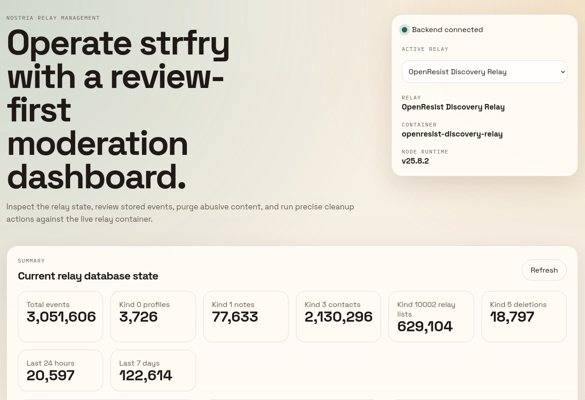
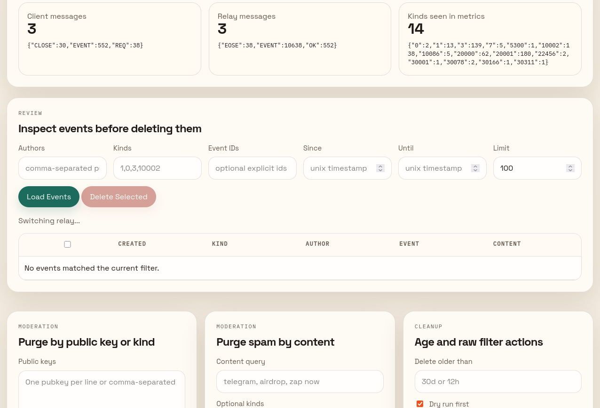
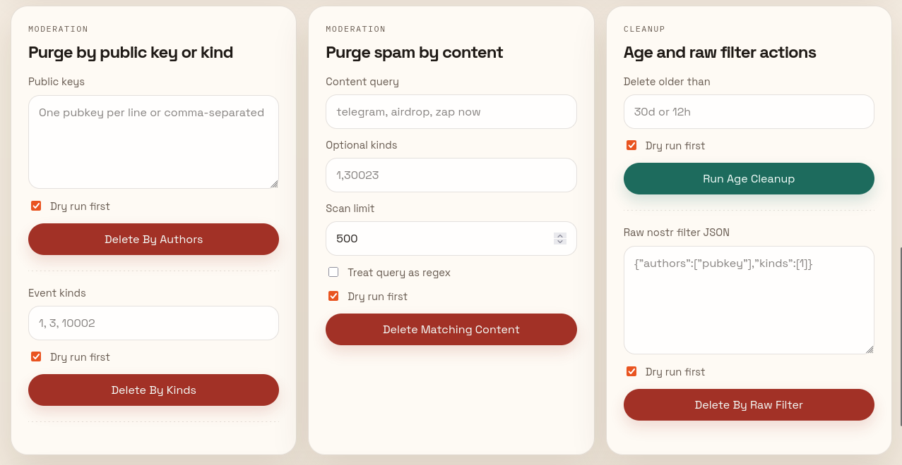

# nostria-relay-management

Local web dashboard for reviewing and moderating events stored in a strfry relay.

## Screenshots

### Overview and relay summary



### Review workflow and event inspection



### Moderation and cleanup actions



## What it does

- Shows summary counters for the current relay database state.
- Reads relay Prometheus metrics from `/metrics` when available.
- Reviews events using `strfry scan` with Nostr filters.
- Deletes events by pubkey, kind, raw filter, selected event IDs, or age.
- Purges spam by scanning events, matching content locally, then deleting the matching IDs in batches.
- Executes all destructive operations through the live Dockerized relay instead of touching LMDB files directly.
- Supports selecting among multiple running relays on the Docker host.

## Current relay defaults

The app currently targets this environment by default:

- Relay container: `openresist-discovery-relay`
- Strfry binary: `/app/strfry`
- Strfry config: `/etc/strfry.conf`
- Metrics endpoint: `http://127.0.0.1:7777/metrics`
- Dashboard URL: `http://127.0.0.1:3095`

These are all configurable with environment variables.

When multiple strfry containers are running, the dashboard will discover them from `docker ps` and let you switch relays from the UI.

## Requirements

- Linux host with Docker CLI access
- Running strfry relay container
- Node.js 20 or newer available locally

Only `express` is required as an application dependency. The frontend is plain HTML, CSS, and browser JavaScript.

## Install

```bash
cd /home/blockcore/src/nostria-relay-management
npm install
```

## Run locally

```bash
cd /home/blockcore/src/nostria-relay-management
npm start
```

Then open:

```text
http://127.0.0.1:3095
```

## Configuration

Environment variables:

- `PORT`: dashboard port, default `3095`
- `RELAY_NAME`: label shown in the UI
- `RELAY_METRICS_URL`: Prometheus metrics endpoint
- `STRFRY_CONTAINER`: Docker container name
- `STRFRY_BINARY_PATH`: path to the strfry binary inside the container
- `STRFRY_CONFIG_PATH`: strfry config path inside the container
- `RELAYS_JSON`: optional JSON array of relay definitions if you want to pin friendly names or non-default metrics URLs
- `DEFAULT_REVIEW_LIMIT`: default review query limit, default `100`
- `STRFRY_SCAN_TIMEOUT_MS`: scan timeout, default `15000`
- `STRFRY_DELETE_TIMEOUT_MS`: delete timeout, default `30000`

Example:

```bash
PORT=3095 \
STRFRY_CONTAINER=openresist-discovery-relay \
RELAY_METRICS_URL=http://127.0.0.1:7777/metrics \
npm start
```

## Moderation workflows

### Review events

Use the review form to query by:

- `authors`
- `kinds`
- `ids`
- `since`
- `until`
- `limit`

The backend turns those values into a Nostr filter and runs `strfry scan`.

### Delete by authors

Use this to remove all events written by one or more pubkeys.

The backend runs:

```text
strfry delete --filter='{"authors":[...]}'
```

### Delete by kinds

Use this to remove all events for one or more event kinds.

The backend runs:

```text
strfry delete --filter='{"kinds":[1,3,10002]}'
```

### Purge spam by content

Strfry does not support deleting directly by content substring. The dashboard handles this by:

1. Running `strfry scan` with an optional author/kind/time filter.
2. Matching event `content` locally using substring or regex.
3. Deleting the matched event IDs in batches with `strfry delete --filter='{"ids":[...]}'`.

Use `dry run` first when tuning spam filters.

### Delete by age

The UI accepts shorthand like:

- `12h`
- `7d`
- `30d`
- `1Y`

The backend converts this to numeric seconds because `strfry delete --age` expects a number.

### Delete by raw filter

Use the raw JSON field when you want direct control over the filter passed to `strfry delete`.

## Safety notes

- The destructive forms default to `dry run` enabled.
- When `dry run` is disabled, the UI first runs a preview and asks for confirmation with the number of matched events and the number that will be deleted.
- Selected-event deletion from the review table runs live deletion, so confirm the current result set first.
- Very broad content scans can be expensive. Start with kind, author, or time constraints when possible.

## Node runtime

The local environment is now using NodeSource Node.js and npm from `/usr/bin`.

Check the active runtime with:

```bash
node -v
npm -v
which node
which npm
```

## Known limitations

- Chronological export browsing is not yet exposed in the UI.
- Metrics are only as complete as the running strfry process and reset when the relay restarts.
- Content-based spam purging only searches the scanned slice, not the entire database, unless you widen the filter and limit accordingly.
